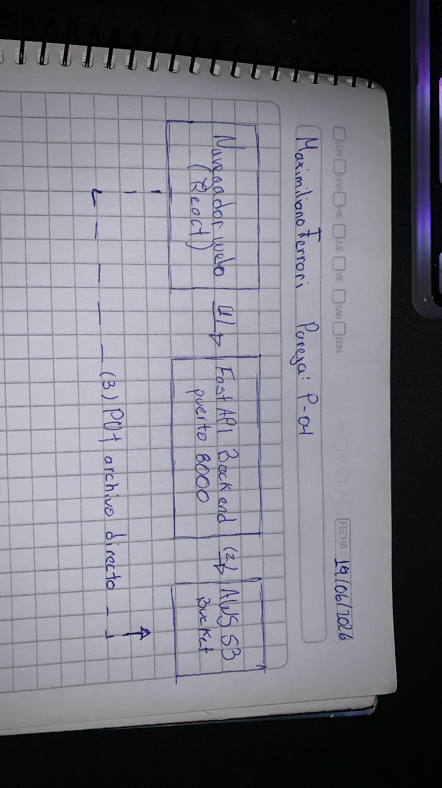

# ArchivaCloud P-04
Integrantes: Maximiliano Ferrari  
Pareja: P-04  
Asignatura: Arquitectura Multi-Cloud  

Parámetros únicos (Anexo B)

| Pareja | Tipos permitidos | Tamaño máx | Bucket / Región | Feature extra |
|--------|-----------------|------------|-----------------|---------------|
| P-04 | CSV, XLSX | 25 MB | archivacloud-p04-ferrari / us-east-1 | Exportar listado como CSV descargable |

## Arquitectura

El archivo se sube directo desde el navegador a S3 usando presigned URLs, sin pasar por el backend.


[Navegador React] --(1) POST /presigned-url--> [FastAPI Backend] --(2)--> [AWS S3]
[Navegador React] --(3) PUT archivo directo-----------------------> [AWS S3]
[FastAPI Backend] --(4) PUT registro--------------------------------> [DynamoDB]

## Stack y versiones

- Python 3.13 + FastAPI + Uvicorn + boto3 + python-dotenv + Pydantic
- React 18 + Vite + axios
- Amazon S3 + DynamoDB
- Git + GitHub

## Variables de entorno

| Variable | Descripción | Ejemplo |
|----------|-------------|---------|
| AWS_ACCESS_KEY_ID | Clave de acceso AWS | ASIA... |
| AWS_SECRET_ACCESS_KEY | Clave secreta AWS | xxxxxxx |
| AWS_SESSION_TOKEN | Token de sesión AWS Academy | xxxxxxx |
| AWS_REGION | Región AWS | us-east-1 |
| S3_BUCKET_NAME | Nombre del bucket | archivacloud-p04-ferrari |

## Política IAM mínima

```json
{
  "Version": "2012-10-17",
  "Statement": [
    {
      "Effect": "Allow",
      "Action": [
        "s3:PutObject",
        "s3:GetObject",
        "s3:DeleteObject",
        "s3:ListBucket"
      ],
      "Resource": [
        "arn:aws:s3:::archivacloud-p04-ferrari",
        "arn:aws:s3:::archivacloud-p04-ferrari/*"
      ]
    }
  ]
}

## Configuración CORS del bucket

```json
[
  {
    "AllowedHeaders": ["*"],
    "AllowedMethods": ["GET", "PUT", "DELETE"],
    "AllowedOrigins": ["http://localhost:5173"],
    "ExposeHeaders": ["ETag"]
  }
]
## Pasos para correr el proyecto

### Backend
```bash
cd backend
pip install -r requirements.txt
python -m uvicorn main:app --reload
```

### Frontend
```bash
cd frontend
npm install
npm run dev

## Auditoría de dependencias

### pip-audit (backend)
Se ejecutó `python -m pip_audit`. Los paquetes del proyecto (fastapi, boto3, uvicorn, pydantic) no presentaron vulnerabilidades. Las vulnerabilidades detectadas corresponden a paquetes globales del sistema (django, pillow) que no forman parte del proyecto.

### npm audit (frontend)
Se ejecutó `npm audit`. Se detectó 1 vulnerabilidad high en form-data, corregida con `npm audit fix`. Resultado final: 0 vulnerabilidades.

## Feature extra

**Exportar listado como CSV descargable:** El botón "Exportar CSV" en el frontend genera y descarga un archivo CSV con el nombre, tamaño y fecha de todos los archivos listados en el bucket. Se implementó con la API nativa de JavaScript (Blob + URL.createObjectURL) sin dependencias externas.

## DynamoDB

Cada vez que se sube un archivo, el backend registra en la tabla `database_dynamodb` el id único, nombre del archivo, fecha de subida, tamaño y tipo.


## Seguridad (SEC-01 a SEC-10)

- **SEC-01:** .env en .gitignore, nunca sube al repositorio
- **SEC-02:** CORS solo permite http://localhost:5173
- **SEC-03:** Validación de extensiones con Pydantic, solo CSV y XLSX
- **SEC-04:** Límite de 25 MB en frontend y backend
- **SEC-05:** Política IAM con 4 acciones específicas sobre el bucket
- **SEC-06:** Block Public Access activo en el bucket S3
- **SEC-07:** Errores sin stack traces, solo mensajes genéricos
- **SEC-08:** Encriptación SSE-S3 activada en el bucket
- **SEC-09:** pip-audit y npm audit ejecutados, vulnerabilidades mitigadas
- **SEC-10:** Todas las llamadas a S3 usan HTTPS mediante presigned URLs

## Autores

- Maximiliano Ferrari — maximiliano.ferrari@inacapmail.cl